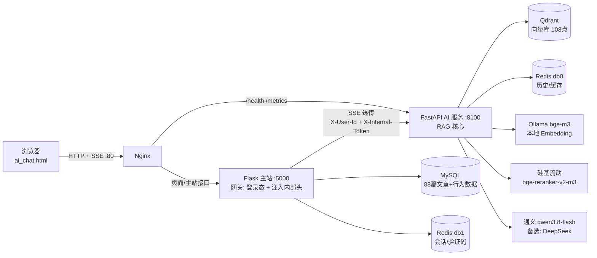
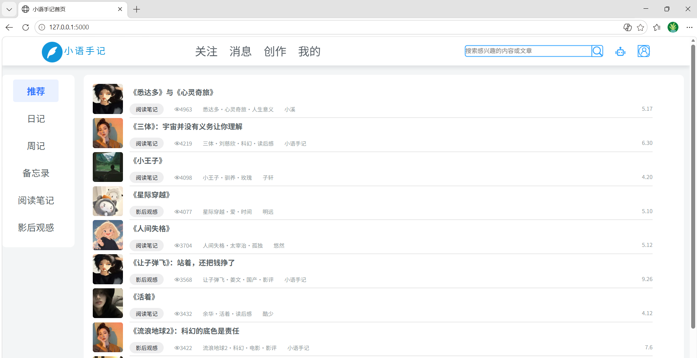
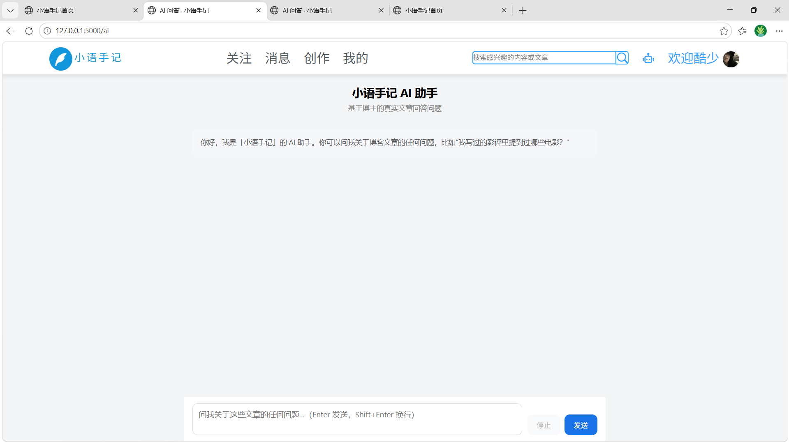
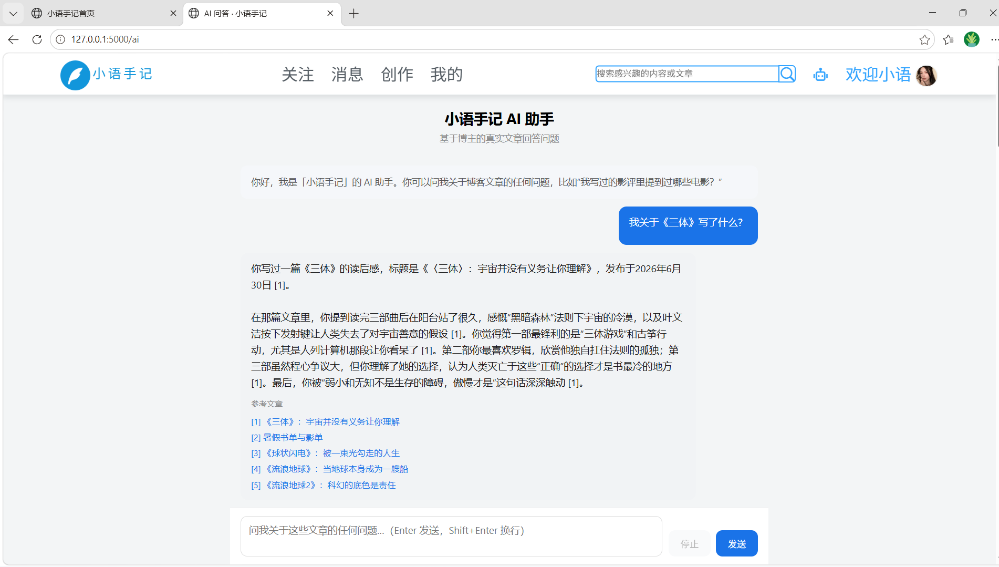
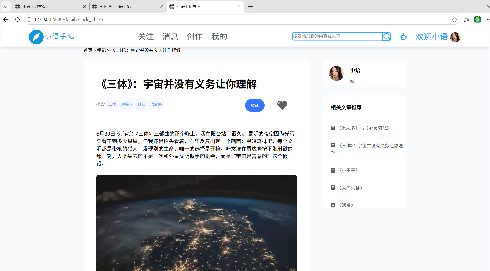

# 小语手记（xiaoyunote）

一个基于 Flask 的个人博客 / 手记社区，在已有的文章、收藏、关注、评论等社交功能之上，**以零侵入方式接入独立 FastAPI RAG 问答服务**：读者用自然语言提问，系统基于博主真实的 88 篇文章流式作答，检索不到则拒答，避免幻觉。

- 主站入口：`main.py`（Flask，端口 `5000`）
- AI 服务：`services/ai_service`（FastAPI，端口 `8100`）
- 本地执行 `python main.py` 会**自动拉起 AI 子进程**，一条命令启动整套服务

## 项目简介

博客原有搜索仅支持关键词匹配，读者常因换了说法就找不到内容。本项目在**不改动主站原有业务代码**的前提下，新增一个 AI 网关蓝图（`controller/ai.py`，注册仅 2 行），把登录态校验留在 Flask，把 RAG 检索与流式生成下沉到独立 FastAPI 服务。检索采用「向量召回 Top15 → Cross-Encoder 精排 Top5 → 0.2 阈值拒答」两阶段链路，配合 Redis 会话历史与检索感知缓存，最终 8 道精确题 Recall@5=1.0，首字延迟 782ms，29 个 pytest 全绿。

## 系统架构



> 关键约束：`/api/ai/chat/stream` **必须经 Flask 网关**，浏览器不能直连 AI 服务——直连缺少 `X-Internal-Token` 会被 AI 服务返回 401。登录态只在 Flask 判定，AI 服务只信内部 Token。

## 快速启动

### 本地开发（一条命令启动）

```powershell
# 1. 主站依赖
python -m venv .venv; .\.venv\Scripts\Activate.ps1; pip install -r requirements.txt
copy .env.example .env        # 填入 DB/邮箱/Redis 真实值

# 2. AI 服务（独立虚拟环境）
cd services\ai_service
python -m venv .venv; .\.venv\Scripts\Activate.ps1; pip install -r requirements.txt
copy .env.example .env        # 填入 LLM/Rerank Key
python scripts\sync_corpus.py # 首次: 从 MySQL 同步语料到 Qdrant
cd ..\..

# 3. 一键启动（自动拉起 AI 子进程）
python main.py                # 访问 http://127.0.0.1:5000
```

依赖服务需自备：MySQL 8（库 `xiaoyushouji`，utf8mb4）、Redis、Qdrant、Ollama（拉取 `bge-m3`）。

### Docker 部署（虚拟机，复用宿主中间件）

```bash
cd ~/xiaoyunote
docker compose -f docker-compose.full.yml up -d --build
# 访问 http://<虚拟机IP>/
```

`docker-compose.full.yml` 只构建 nginx / flask / ai 三个容器，MySQL / Redis / Qdrant / Ollama 复用宿主机已有服务（经 `host.docker.internal` 访问）。前置条件：宿主 MySQL 授权 `xiaoyu@'%'`、Qdrant/Redis/Ollama 监听 `0.0.0.0`。

## 效果展示

### 首页 · 文章信息流



### AI 问答 · 基于真实文章的流式对话



向 AI 提问「我关于《三体》写了什么？」，系统检索到对应文章后逐字流式输出回答，并标注引用来源：



### 文章详情页



## 目录结构

```
xiaoyunote/
├── main.py                    # Flask 入口；本地自动拉起 AI 子进程，容器内只跑 Flask
├── requirements.txt           # 主站依赖
├── .env / .env.example        # 主站环境变量（.env 不入库）
├── Dockerfile / .dockerignore # 主站镜像（分层构建）
├── docker-compose.full.yml    # 虚拟机完整部署编排（nginx/flask/ai 三容器）
├── deploy/nginx-full.conf     # Nginx 配置（含 SSE 反代 + X-Accel-Buffering）
├── app/                       # 应用工厂与配置
│   ├── app.py                 #   create_app()、SECRET_KEY 加载（env > 文件 > 生成）
│   ├── settings.py            #   FLASK_ENV
│   └── config/config.py       #   数据库 / 邮箱 / Redis 配置（读环境变量）
├── common/                    # 公共工具：数据库连接、Redis、邮件、响应封装
├── controller/                # 控制器层（Flask 蓝图）
│   └── ai.py                  #   AI 网关：鉴权 + 注入身份头 + SSE 透传
├── model/                     # 模型层（SQLAlchemy 表模型与数据操作）
├── template/                  # 视图层（Jinja2 页面，含 ai_chat.html）
├── resource/                  # 前端静态资源（css/js/字体/图片/插件，随仓库提交）
│   └── upload/                #   用户上传内容（不入库，仅保留 .gitkeep）
├── log/                       # 运行日志（不入库，仅保留 .gitkeep）
├── tests/                     # 主站测试（AI 网关等）
└── services/ai_service/       # 独立 FastAPI AI 服务（自有 .venv / .env / Dockerfile）
    ├── ai_app/
    │   ├── main.py            #   FastAPI 入口
    │   ├── config.py          #   pydantic-settings 配置
    │   ├── routers/           #   chat / health / debug
    │   └── services/          #   retriever / rerank / llm / vector_store / cache / history
    ├── scripts/               # 语料同步 / 导出 / 评测 / 压测脚本
    ├── tests/                 # 9 个测试文件，26 个用例
    └── docs/                  # 技术选型 / 架构契约 / 评测记录
```

## 核心设计

- **两阶段检索**：bge-m3 向量召回 Top15 → bge-reranker-v2-m3 精排 Top5 → 0.2 阈值过滤，空结果拒答
- **Flask 网关模式**：登录态只在主站判定，AI 服务只信 `X-Internal-Token`，AI 端口不对外暴露
- **多用户隔离**：Qdrant payload 按 `user_id` 过滤；收藏/点赞/评论作为独立 `data_type` 入库
- **防幻觉双保险**：检索层阈值 + 提示词「原样拒答」话术
- **降级分级**：Redis / Rerank / MySQL(同步) 可 fail-open；Qdrant / Embedding / LLM 不可降级
- **检索感知缓存**：指纹含 `chunk_id`，语料更新自动失效
- **可观测性**：JSON 结构化日志（trace_id + user_id + elapsed_ms + recall + cache_hit + refused）；`/metrics` 暴露 requests / refusal_rate / cache_hit_rate / p50 / p95 / p99

## Roadmap（已知薄弱点 → 未来规划）

> 同一个事实，写在简历上是漏洞，写在这里是自我认知与规划能力。以下均来自开发期的真实风险评估与评测发现。

| # | 当前状态（薄弱点） | 规划方向 | 来源 |
|---|---|---|---|
| 1 | FastAPI 单实例，流量放大后并发瓶颈 | 加 worker + Nginx 负载均衡 | 技术选型风险表 |
| 2 | Qdrant 单机，千万级向量后性能下降 | Qdrant 水平扩展，或迁移 Milvus | 技术选型风险表 |
| 3 | 本地 Ollama，GPU 显存不足、多 worker 冲突 | 降为 1 worker，或迁移 vLLM | 技术选型风险表 |
| 4 | 硅基流动 Rerank 免费档，存在限流 | 切换付费档或备用 Rerank 服务 | 技术选型风险表 |
| 5 | 通义 LLM 按量计费，流量上升成本增加 | 切换 DeepSeek 或本地 LLM 兜底 | 技术选型风险表 |
| 6 | Flask 网关单点 | 主站多实例 + Nginx 负载均衡 | 技术选型风险表 |
| 7 | 聚合类问题（跨多篇文章）回答能力不足 | 已将 TopK 由 5 调至 15，继续用行为数据补充上下文 | eval-score-v1 / params-frozen |
| 8 | 语义相似的无关问题（如"昆明天气"召回"昆明的雨"）检索层阈值拦不住 | 最终拒答由 LLM 层兜底，数据层阈值仍待进一步校准 | params-frozen T13 |

## TROUBLESHOOTING（开发期排查台账）

> 以下为开发与部署中**实际遇到**的问题及解法，按类别整理。共 24 条，不做编造。

### RAG / 检索质量

| # | 现象 | 根因 | 解法 |
|---|---|---|---|
| 1 | 应能答的题被拒答（Q1/3/4/5/10） | 初始阈值 0.4 过高 + 向量检索对泛化查询召回弱 | 阈值降至 0.2 |
| 2 | 聚合类问题无法回答（Q6/7/8） | TopK=5 太小，跨文档聚合能力不足 | TopK 调至 15 |
| 3 | 无关问题"昆明天气"被回答 | 语料含大量"昆明的雨"，向量语义相似，阈值拦不住 | 最终拒答交由 LLM 层判断 |
| 4 | 模型自称"我自己写的"，身份错位 | 提示词未明确 AI 是助手而非博主 | 修正规则 4，强制用"你"称呼博主 |
| 5 | 引用编号全是【1】，不区分来源 | Dify 把多条召回片段合并为单一 context | 工程化自行拼装 context，按片段编号 |
| 6 | 首字延迟 3.8s，体验差 | qwen3.8-flash 默认开启 thinking 模式 | API 传 `enable_thinking: False`，TTFT 降至 782ms |
| 7 | Dify 无法导入 `.jsonl` | Dify 社区版不支持 `.jsonl` 直接上传 | 改用逐篇 TXT + API 批量导入 |
| 8 | 混合检索返回空结果 | Dify 1.17.0 平台层问题 | 放弃混合检索，采用向量检索 + Rerank |
| 9 | 语料含 HTML 标签污染 | 文章正文来自富文本编辑器 | 导出 TXT 时清洗标签 |
| 10 | Rerank 分数体系与 Dify 不一致 | 工程版原始分约 0.30，Dify 做了归一化 | 阈值按工程版实际分数重新校准 |
| 11 | Ollama 首次调用很慢 | 模型冷启动加载 | 预热 / 接受首次约 14s 延迟 |
| 12 | 安全题检索层未拒答 | 阈值 0.2 拦不住语义相似问题 | 依赖 LLM 层拒答（已验证生效） |

### 架构 / 部署

| # | 现象 | 根因 | 解法 |
|---|---|---|---|
| 13 | SSE 流式输出被缓冲，前端一次性收到 | Nginx 默认开启代理缓冲 | 响应头加 `X-Accel-Buffering: no` |
| 14 | 浏览器直连 AI 服务返回 401 `invalid internal token` | 直连请求缺少 `X-Internal-Token` | `/api/ai/chat/stream` 必须经 Flask 网关 |
| 15 | git 历史提交含明文 MySQL 密码与邮箱授权码 | 早期 config.py 硬编码凭据 | 迁移至 `.env`，建议轮换凭据 |
| 16 | `.env.example` 行尾中文注释被解析进变量值 | dotenv/pydantic 把行内注释当值 | 去掉行内注释，注释单独成行 |
| 17 | 新克隆仓库无样式 | `.gitignore` 一刀切 `resource/` 导致静态资源未入库 | 精细化规则：提交 css/js/字体/默认图，仅忽略 upload 与用户头像 |
| 18 | PowerShell 远程执行脚本报 `$'\r': command not found` | Windows 换行符 CRLF 传入 Linux | 传管道前 `sed "s/\r$//"` 或用 LF |
| 19 | 本机 Docker 镜像拉取失败 | 默认镜像加速器失效 | 切换可用加速器（如 daocloud） |
| 20 | 容器内连不上 MySQL | 误连容器内 3307（授权不全） | 复用宿主机原生 MySQL 3306，`host.docker.internal` |
| 21 | SECRET_KEY 每次重启变化导致 session 失效 | 未持久化密钥 | 优先级：环境变量 → `.secret_key` 文件 → 自动生成 |
| 22 | AI 服务地址读取混乱 | 硬编码与环境变量混用 | 统一优先级：环境变量 → `ai_service/.env` → `127.0.0.1:8100` |
| 23 | 容器内 Flask 又拉起 AI 子进程 | `main.py` 默认拉起子进程 | `RUNNING_IN_DOCKER=1` 或 `/.dockerenv` 检测，容器内 `START_AI_CHILD=0` |
| 24 | Redis 挂掉后问答不可用 | 缓存与历史强依赖 Redis | Redis 设为 fail-open：挂了照常问答，仅日志 warn |

## 环境变量

### 根目录 `.env`（Flask 主站）

| 变量 | 说明 |
| --- | --- |
| `DB_HOST` / `DB_PORT` / `DB_USER` / `DB_PASSWORD` / `DB_NAME` / `DB_CHARSET` | MySQL 连接（本地开发端口按实际填写；容器由 compose 覆盖为宿主 3306） |
| `MAIL_USERNAME` / `MAIL_PASSWORD` | 发件邮箱与 **SMTP 授权码**（非登录密码） |
| `REDIS_HOST` / `REDIS_PORT` / `REDIS_PASSWORD` / `REDIS_DB` | Redis，主站用 db1；无密码时 `REDIS_PASSWORD=` 留空 |
| `FLASK_ENV` | `test` / `production` |
| `SECRET_KEY` | Flask 会话密钥；未设置时回退读取 `.secret_key` 文件，再没有则自动生成 |
| `AI_SERVICE_URL` | Flask 调用 AI 服务的地址（本地 `http://127.0.0.1:8100`，容器 `http://ai:8100`） |
| `AI_INTERNAL_TOKEN` | 调用 AI 服务的内部 Token，**必须与 AI 服务的 `INTERNAL_TOKEN` 一致** |
| `START_AI_CHILD` | 可选。`main.py` 是否自动拉起 AI 子进程；本地默认 `1`，容器内默认 `0` |
| `FLASK_RUN_HOST` / `FLASK_RUN_PORT` | 可选。Flask 监听地址/端口，默认 `127.0.0.1:5000`；镜像内由 Dockerfile 注入 `0.0.0.0` |
| `RUNNING_IN_DOCKER` | 容器标识，Dockerfile 自动置为 `1`（也可通过 `/.dockerenv` 探测），无需在 `.env` 中配置 |

### `services/ai_service/.env`（AI 服务）

| 变量 | 说明 |
| --- | --- |
| `INTERNAL_TOKEN` | 内部鉴权 Token，与主站 `AI_INTERNAL_TOKEN` 保持一致 |
| `LLM_API_KEY` | 通义 DashScope Key |
| `RERANK_API_KEY` | 硅基流动 Rerank Key |
| `DIFY_API_KEY` | **预留项，当前运行时不读取**（配置类忽略多余变量），可留空或删除 |
| `MYSQL_DSN` | 主站 MySQL 只读 DSN，供 `scripts/sync_corpus.py` 同步语料 |
| `EMBED_BASE_URL` / `QDRANT_URL` / `REDIS_URL` | Ollama / Qdrant / Redis 地址，默认值见 `ai_app/config.py` |

> 容器部署时，`QDRANT_URL`、`REDIS_URL`、`EMBED_BASE_URL`、`INTERNAL_TOKEN`、`MYSQL_DSN` 由 `docker-compose.full.yml` 的 `environment` 覆盖，以 compose 为准。

## 常用运维命令

```bash
docker compose -f docker-compose.full.yml ps              # 查看三容器状态
docker compose -f docker-compose.full.yml logs -f flask
docker compose -f docker-compose.full.yml restart ai
docker compose -f docker-compose.full.yml up -d --build flask   # 仅重建主站
docker compose -f docker-compose.full.yml down            # 停止并移除容器（不删数据）
```

## 测试

```powershell
# 主站（AI 网关）
python -m pytest tests/ -v

# AI 服务
cd services\ai_service && .\.venv\Scripts\Activate.ps1
python -m pytest tests/ -v
```

合计 29 个用例（AI 服务 26 + Flask 网关 3），全绿。

## Git 与安全约定

- `.env`、`services/ai_service/.env`、`.secret_key` 均被 `.gitignore` 忽略，**严禁提交真实密钥**；新环境从对应的 `.env.example` 复制。
- `resource/` 下的样式、脚本、字体、默认图片、第三方插件**随仓库提交**；只有用户运行时产物不入库：
  - `resource/upload/*`（保留 `.gitkeep`）
  - 用户头像 `resource/images/headers/user_*.jpg`（默认头图 `1.jpg`~`20.jpg` 入库）
  - `log/*`（保留 `.gitkeep`）
- 提交前建议检查暂存内容：`git diff --cached --name-only`，确认没有密钥与用户数据。
- ⚠️ 历史提交 `2d3eea2` 曾含明文 MySQL 密码与邮箱授权码，**请尽快轮换凭据**（改 MySQL `xiaoyu` 密码 + 重置 QQ 邮箱 SMTP 授权码），并同步更新 `.env` 与部署环境。

## 默认账号

本地 / 初始化数据中的测试账号：用户名与密码均为 `123456`（仅供开发测试，正式环境请修改）。
