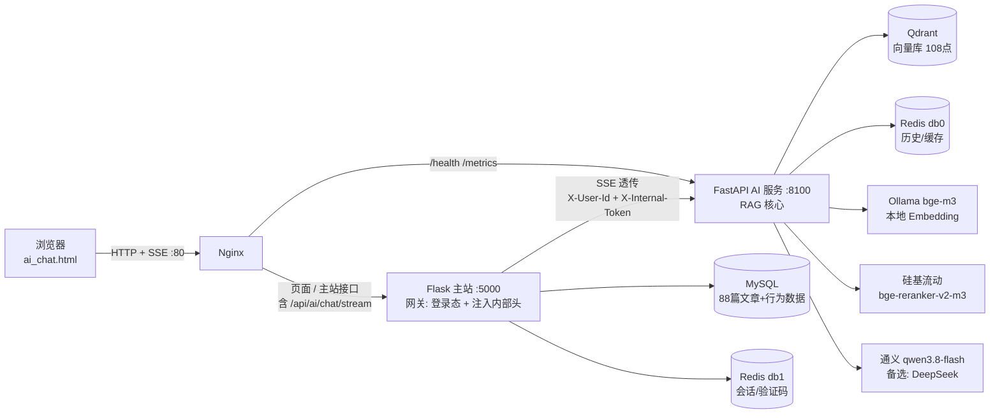

# 小语手记（xiaoyunote）

一个独立开发的 Flask 多用户博客 / 手记社区，从零实现了文章、收藏、关注、评论等完整社交功能，并在其上**以零侵入方式接入独立 FastAPI RAG 问答服务**：读者用自然语言提问，系统基于博主真实的 88 篇文章流式作答，检索不到则拒答，避免幻觉。

- 主站入口：`main.py`（Flask，端口 `5000`）
- AI 服务：`services/ai_service`（FastAPI，端口 `8100`）
- 本地执行 `python main.py` 会**自动拉起 AI 子进程**，一条命令启动整套服务

## 项目简介

从 0 到 1 独立开发了 Flask 多用户博客主站（MVC 架构）：文章发布/编辑/删除、Markdown 富文本、用户注册登录、收藏、点赞、评论、关注、消息通知——全栈闭环。为提升使用体验，让用户能随时回顾自己的创作、了解自己的成长变化，**在不改动已有业务代码的前提下**，以新增蓝图（`controller/ai.py`，注册仅 2 行）零侵入接入独立 FastAPI RAG 服务——用户用自然语言提问（如"我写过哪些影评"），系统基于真实文章流式作答。架构上把登录态留在 Flask，把向量检索与流式生成下沉到 AI 层。检索采用「向量召回 Top15 → Cross-Encoder 精排 Top5 → 0.2 阈值拒答」两阶段链路，配合 Redis 会话历史与检索感知缓存，最终 8 道精确题 Recall@5=1.0，首字延迟 782ms，29 个 pytest 全绿。

## 核心指标

| 指标 | 数值 |
| --- | --- |
| 精确题 Recall@5 | **1.0**（8/8） |
| 首字延迟 TTFT | **782 ms**（优化前 3791 ms，降幅 79%） |
| 端到端延迟 P50 | 约 4.9 s |
| 缓存命中提速 | **5.4 倍**（3675 ms → 678 ms） |
| 自动化测试 | **29 个全部通过**（AI 服务 26 + 网关 3） |


## 系统架构



> **关键约束**：`/api/ai/chat/stream` **必须经 Flask 网关**——Nginx 把该路由转发给 Flask（见 `deploy/nginx-full.conf` 中的 `location = /api/ai/chat/stream`），Flask 校验 session 登录态后注入 `X-User-Id` + `X-Internal-Token`，再转发给 AI 服务。浏览器不能直连 AI 服务（直连缺少 `X-Internal-Token` 会返回 401）；`/health`、`/metrics` 才由 Nginx 直达 AI 服务。

## 快速启动

### 本地开发（一条命令启动）

```powershell
# 1. 主站依赖
python -m venv .venv; .\.venv\Scripts\Activate.ps1; pip install -r requirements.txt
copy .env.example .env        # 填入 DB/邮箱/Redis 真实值

# 2. AI 服务（独立虚拟环境）
cd services\ai_service
python -m venv .venv; .\.venv\Scripts\Activate.ps1; pip install -r requirements.txt
copy .env.example .env        # 填入 LLM/Rerank Key
python scripts\sync_corpus.py # 首次: 从 MySQL 同步语料到 Qdrant
cd ..\..

# 3. 一键启动（自动拉起 AI 子进程）
python main.py                # 访问 http://127.0.0.1:5000
```

依赖服务需自备：MySQL 8（库 `xiaoyushouji`，utf8mb4）、Redis、Qdrant、Ollama（拉取 `bge-m3`）。

### Docker 部署（虚拟机，复用宿主中间件）

```bash
cd ~/xiaoyunote
docker compose -f docker-compose.full.yml up -d --build
# 访问 http://<虚拟机IP>/
```

`docker-compose.full.yml` 只构建 nginx / flask / ai 三个容器，MySQL / Redis / Qdrant / Ollama 复用宿主机已有服务（经 `host.docker.internal` 访问）。前置条件：宿主 MySQL 授权 `xiaoyu@'%'`、Qdrant/Redis/Ollama 监听 `0.0.0.0`。

> **注意**：`deploy/nginx-full.conf` 中 `/api/ai/chat/stream` 必须指向 `flask_backend`（走 Flask 网关），不能指向 `ai_backend`——否则浏览器直连 AI 服务会因缺少内部 Token 返回 401。

## 效果展示

### 首页 · 文章信息流


### AI 问答 · 基于真实文章的流式对话


向 AI 提问「我关于《三体》写了什么？」，系统检索到对应文章后逐字流式输出回答，并标注引用来源：


### 文章详情页


## 目录结构

```
xiaoyunote/
├── main.py                    # Flask 入口；本地自动拉起 AI 子进程，容器内只跑 Flask
├── requirements.txt           # 主站依赖
├── .env / .env.example        # 主站环境变量（.env 不入库）
├── Dockerfile / .dockerignore # 主站镜像（分层构建）
├── docker-compose.full.yml    # 虚拟机完整部署编排（nginx/flask/ai 三容器）
├── deploy/nginx-full.conf     # Nginx 配置（含 SSE 反代 + X-Accel-Buffering）
├── app/                       # 应用工厂与配置
│   ├── app.py                 #   create_app()、SECRET_KEY 加载（env > 文件 > 生成）
│   ├── settings.py            #   FLASK_ENV
│   └── config/config.py       #   数据库 / 邮箱 / Redis 配置（读环境变量）
├── common/                    # 公共工具：数据库连接、Redis、邮件、响应封装
├── controller/                # 控制器层（Flask 蓝图）
│   └── ai.py                  #   AI 网关：鉴权 + 注入身份头 + SSE 透传
├── model/                     # 模型层（SQLAlchemy 表模型与数据操作）
├── template/                  # 视图层（Jinja2 页面，含 ai_chat.html）
├── resource/                  # 前端静态资源（css/js/字体/图片/插件，随仓库提交）
│   └── upload/                #   用户上传内容（不入库，仅保留 .gitkeep）
├── log/                       # 运行日志（不入库，仅保留 .gitkeep）
├── tests/                     # 主站测试（AI 网关等）
└── services/ai_service/       # 独立 FastAPI AI 服务（自有 .venv / .env / Dockerfile）
    ├── ai_app/
    │   ├── main.py            #   FastAPI 入口
    │   ├── config.py          #   pydantic-settings 配置
    │   ├── routers/           #   chat / health / debug
    │   └── services/          #   retriever / rerank / llm / vector_store / cache / history
    ├── scripts/               # 语料同步 / 导出 / 评测 / 压测脚本
    ├── tests/                 # 9 个测试文件，26 个用例
    └── docs/                  # 技术选型 / 架构契约 / 评测记录
```

## 核心设计

- **两阶段检索**：bge-m3 向量召回 Top15 → bge-reranker-v2-m3 精排 Top5 → 0.2 阈值过滤，空结果拒答
- **Flask 网关模式**：登录态只在主站判定，AI 服务只信 `X-Internal-Token`，AI 端口不对外暴露
- **多用户隔离**：Qdrant payload 按 `user_id` 过滤；收藏/点赞/评论作为独立 `data_type` 入库
- **防幻觉双保险**：检索层阈值 + 提示词「原样拒答」话术
- **降级分级**：Redis / Rerank / MySQL(同步) 可 fail-open；Qdrant / Embedding / LLM 不可降级
- **检索感知缓存**：指纹含 `chunk_id`，语料更新自动失效
- **可观测性**：JSON 结构化日志（trace_id + user_id + elapsed_ms + recall + cache_hit + refused）；`/metrics` 暴露 requests / refusal_rate / cache_hit_rate / p50 / p95 / p99

## 开发方法

- **选型先行**：对 Web 框架、RAG 框架、模型与向量库逐项对比后决策，每个落选项均记录了不选的理由（对比表见 `services/ai_service/docs/02-技术选型确认表.md`）
- **低代码验证 → 参数冻结 → 工程化**：先在 Dify 搭建 RAG 工作流，验证并冻结分块（800/50）、TopK（15）、阈值（0.2）与系统提示词，再用 FastAPI 自研交付，两者共用同一套模型服务（评测记录见 `services/ai_service/docs/dify/`）
- **评测驱动**：15 题评测集（8 道精确题 + 7 道开放/安全题，题目与基线评分见 `services/ai_service/docs/dify/eval-score-v1.md`）+ 回归评测（`eval-regression.md`），每次参数调整都有分数支撑；8 道精确题 Recall@5 = 1.0

## 核心接口

### `POST /api/ai/chat/stream`（浏览器唯一入口，经 Flask 网关）

请求体：

```json
{
  "question": "我关于《三体》写了什么？",
  "session_id": "sess-abc12345"
}
```

响应为 `text/event-stream`，正常事件序列：

```
event: sources  → {"items":[{"article_id","title","category","data_type","score"}]}
event: delta    → {"text":"..."}        # 重复 N 次，逐字流式
event: done     → {"elapsed_ms":4372}
data: [DONE]
```

检索无结果时拒答（不调用 LLM）：

```
event: refused → {"text":"这个问题在我的笔记里没有找到相关内容..."}
event: done    → {"elapsed_ms":320}
data: [DONE]
```

状态码：`200` 正常 / `401` 未登录或内部 Token 错误 / `422` 参数非法（问题为空或会话 ID 不合法）/ `502` AI 服务不可用。

### `GET /health`

```json
{"status": "ok", "service": "xiaoyunote-ai", "qdrant": "up", "redis": "up", "llm": "configured"}
```

### `GET /metrics`

返回进程内聚合指标（不泄露用户内容）：`requests`、`refused`、`cache_hit`、`errors`、`refusal_rate`、`cache_hit_rate`、`p50_ms`、`p95_ms`、`p99_ms`。

## 参数配置（params-frozen-v1）

参数集中在 `services/ai_service/ai_app/config.py`，均可通过 `.env` 覆盖。

| 参数 | 冻结值 |
| --- | --- |
| 检索模式 | 向量检索 + Rerank（Dify 混合检索平台层有缺陷，弃用） |
| 向量召回 TopK（`RECALL_TOP_K`） | 15 |
| 精排 TopN（`RERANK_TOP_N`） | 5 |
| 相关性阈值（`SCORE_THRESHOLD`） | 0.2 |
| 分块大小 / 重叠 | 800 / 50 |
| Embedding | bge-m3（1024 维，本地 Ollama） |
| Rerank | BAAI/bge-reranker-v2-m3 |
| LLM | qwen3.8-flash（备选 deepseek-chat） |
| 温度（`LLM_TEMPERATURE`） | 0.3 |
| `enable_thinking` | False（TTFT 3791ms → 782ms） |
| 会话历史 | Redis List 保留最近 3 轮 |

## Roadmap

| # | 当前状态 | 规划方向 |
|---|---|---|
| 1 | FastAPI 单实例，并发量上升后有瓶颈 | 加 worker + Nginx 负载均衡 |
| 2 | Qdrant 单机，千万级向量后性能下降 | 水平扩展或迁移 Milvus |
| 3 | 本地 Ollama，GPU 显存有限 | 迁移 vLLM，提升并发能力 |
| 4 | Rerank 依赖云 API，免费档有限流 | 切换付费档或备用服务 |
| 5 | LLM 按量计费，流量上升成本增加 | 切换 DeepSeek 或本地 LLM 兜底 |
| 6 | Flask 网关单点 | 主站多实例 + Nginx 负载均衡 |
| 7 | 聚合类问题（跨多篇文章）回答能力有限 | 按意图动态调整 TopK，或结构化查询辅助 |
| 8 | 语义相似的无关问题（如"昆明天气"召回"昆明的雨"）阈值拦截不够精确 | 引入意图分类器辅助判断 |
| 9 | 多 Agent 协作写作工作流 | LangGraph + MCP 工具接入 |

## 关键工程经验

开发过程中验证得到的关键问题与方案。

### RAG 检索与生成

| 问题 | 方案 |
| --- | --- |
| 初始阈值 0.4 误杀大量可回答问题 | 阈值降至 0.2，精确题 Recall@5 达 1.0 |
| TopK=5 时跨多篇文章的聚合题无法回答 | TopK 调至 15，平衡召回与噪声 |
| 语义相似的无关问题（"昆明天气"召回"昆明的雨"）检索层阈值拦不住 | 分层拒答：检索层阈值初筛，LLM 层对安全 / 无关问题兜底拒答 |
| 模型自称"我自己写的"，身份错位 | 提示词明确 AI 是助手，统一用"你"称呼博主 |
| Dify 将多条召回片段合并为单一 context，引用编号全是【1】 | 工程化自行拼装 context，按片段独立编号与溯源 |
| qwen3.8-flash 默认 thinking 模式导致首字延迟 3.8s | API 传 `enable_thinking: False`，TTFT 降至 782ms |
| Dify 1.17.0 混合检索平台层缺陷、返回空结果 | 弃用混合检索，改为「向量召回 + Cross-Encoder Rerank」两阶段架构 |
| 工程版 Rerank 原始分（约 0.30）与 Dify 归一化分数量纲不一致 | 阈值不照搬 Dify，按工程版实测分布重新校准 |

### 架构与工程

| 问题 | 方案 |
| --- | --- |
| SSE 流式输出被 Nginx 缓冲，前端一次性收到整段回答 | 响应头 `X-Accel-Buffering: no` + `proxy_buffering off` |
| 浏览器直连 AI 服务拿到 401 | 问答流量统一走 Flask 网关注入内部 Token，AI 端口不对外暴露 |
| Redis 故障会导致问答整体不可用 | Redis / Rerank 设为 fail-open 降级，问答主链路不中断 |

## 环境变量

### 根目录 `.env`（Flask 主站）

| 变量 | 说明 |
| --- | --- |
| `DB_HOST` / `DB_PORT` / `DB_USER` / `DB_PASSWORD` / `DB_NAME` / `DB_CHARSET` | MySQL 连接（本地开发端口按实际填写；容器由 compose 覆盖为宿主 3306） |
| `MAIL_USERNAME` / `MAIL_PASSWORD` | 发件邮箱与 **SMTP 授权码**（非登录密码） |
| `REDIS_HOST` / `REDIS_PORT` / `REDIS_PASSWORD` / `REDIS_DB` | Redis，主站用 db1；无密码时 `REDIS_PASSWORD=` 留空 |
| `FLASK_ENV` | `test` / `production` |
| `SECRET_KEY` | Flask 会话密钥；未设置时回退读取 `.secret_key` 文件，再没有则自动生成 |
| `AI_SERVICE_URL` | Flask 调用 AI 服务的地址（本地 `http://127.0.0.1:8100`，容器 `http://ai:8100`） |
| `AI_INTERNAL_TOKEN` | 调用 AI 服务的内部 Token，**必须与 AI 服务的 `INTERNAL_TOKEN` 一致** |
| `START_AI_CHILD` | 可选。`main.py` 是否自动拉起 AI 子进程；本地默认 `1`，容器内默认 `0` |
| `FLASK_RUN_HOST` / `FLASK_RUN_PORT` | 可选。Flask 监听地址/端口，默认 `127.0.0.1:5000`；镜像内由 Dockerfile 注入 `0.0.0.0` |
| `RUNNING_IN_DOCKER` | 容器标识，Dockerfile 自动置为 `1`（也可通过 `/.dockerenv` 探测），无需在 `.env` 中配置 |

### `services/ai_service/.env`（AI 服务）

| 变量 | 说明 |
| --- | --- |
| `INTERNAL_TOKEN` | 内部鉴权 Token，与主站 `AI_INTERNAL_TOKEN` 保持一致 |
| `LLM_API_KEY` | 通义 DashScope Key |
| `RERANK_API_KEY` | 硅基流动 Rerank Key |
| `DIFY_API_KEY` | 预留项（当前版本不读取），可留空 |
| `MYSQL_DSN` | 主站 MySQL 只读 DSN，供 `scripts/sync_corpus.py` 同步语料 |
| `EMBED_BASE_URL` / `QDRANT_URL` / `REDIS_URL` | Ollama / Qdrant / Redis 地址，默认值见 `ai_app/config.py` |

> 容器部署时，`QDRANT_URL`、`REDIS_URL`、`EMBED_BASE_URL`、`INTERNAL_TOKEN`、`MYSQL_DSN` 由 `docker-compose.full.yml` 的 `environment` 覆盖，以 compose 为准。

## 常用运维命令

```bash
docker compose -f docker-compose.full.yml ps              # 查看三容器状态
docker compose -f docker-compose.full.yml logs -f flask
docker compose -f docker-compose.full.yml restart ai
docker compose -f docker-compose.full.yml up -d --build flask   # 仅重建主站
docker compose -f docker-compose.full.yml down            # 停止并移除容器（不删数据）
```

## 测试

```powershell
# 主站（AI 网关）
python -m pytest tests/ -v

# AI 服务
cd services\ai_service && .\.venv\Scripts\Activate.ps1
python -m pytest tests/ -v
```

合计 29 个用例（AI 服务 26 + Flask 网关 3），全绿。

## Git 与安全约定

- `.env`、`services/ai_service/.env`、`.secret_key` 均被 `.gitignore` 忽略，**严禁提交真实密钥**；新环境从对应的 `.env.example` 复制。
- `resource/` 下的样式、脚本、字体、默认图片、第三方插件**随仓库提交**；只有用户运行时产物不入库：
  - `resource/upload/*`（保留 `.gitkeep`）
  - 用户头像 `resource/images/headers/user_*.jpg`（默认头图 `1.jpg`~`20.jpg` 入库）
  - `log/*`（保留 `.gitkeep`）
- 提交前建议检查暂存内容：`git diff --cached --name-only`，确认没有密钥与用户数据。
